# File Storage REST service

**Description:**
  Developing an application that allows us to store files in the cloud, categorize them with tags and search through them.
  
**Link to the task**
  https://docs.google.com/document/d/1g4ULxHWuZXnzZK3OoAq30NB0LEUMkvYyAcwyI2FDTi0/edit#heading=h.a5ad4zfbwpvb

**Requirements**
* As a data storage, please use Elasticsearch.
* As a main framework please use Spring Boot.
* Please use Java 11 and Maven for this project
* Use GitHub, GitLab for your development - at your choice. You will send a link to the final repo with code for check.
* Provide a README.md file with a description of the project, how to run it etc.
* Try to use best code practices, apply commenting on code when necessary.

**Required Methods:**
1. Upload 
POST /file
{
   "name": "file_name.ext"
   "size" : 121231                           # size in bytes
}

returns status 200 and body:
{
   "ID": "unique file ID"
}
or status 400 with error if one of the field is absent or has incorrect value (like negative file size)
{
  "success": false,
  "error": "error description"
}

* Realization:
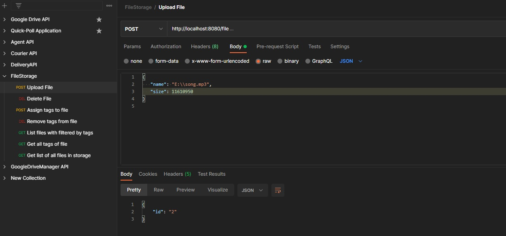

2. Delete file
DELETE  /file/{ID}

returns status 200 and body
{"success": true}

or 404 and body
{
  "success": false,
  "error": "file not found"
}

* Realization:
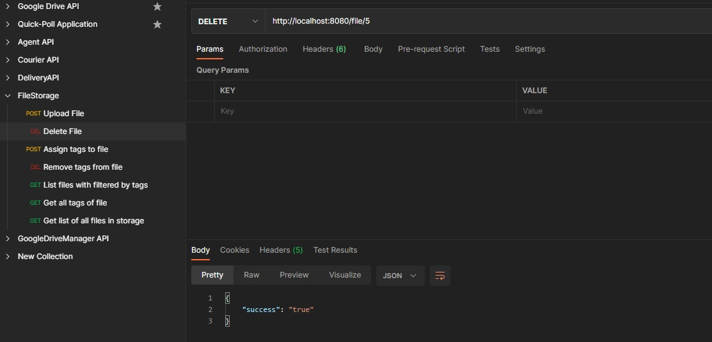

3. Assign tags to file
POST /file/{ID}/tags

["tag1", "tag2", "tag3"]

returns status 200 and body
{"success": true}

* Realization:
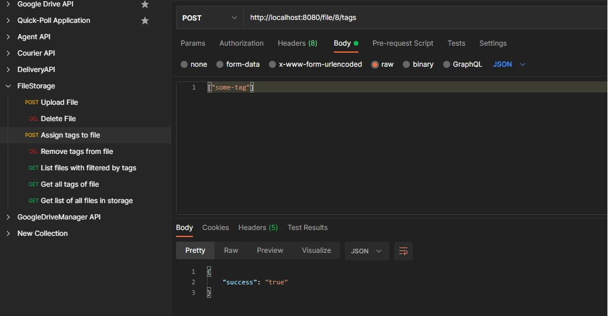

4. Remove tags from file
DELETE /file/{ID}/tags
["tag1", "tag3"]

returns status 200 if all OK and body
{"success": true}

returns status 400 if one of the tags is not present on the file and body
{
  "success": false,
  "error": "tag not found on file"
}

* Realization:
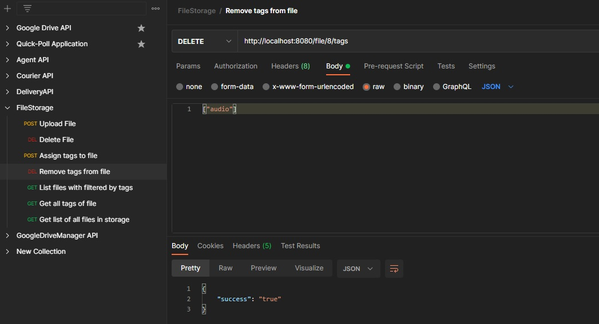

5. List files with pagination optionally filtered by tags
GET /file?tags=tag1,tag2,tag3&page=2&size=3

Here:
* tags - [optional] list of tags to filter by. Only files containing ALL of supplied tags should return. If tags parameter is omitted - don't apply tags filtering i.e. return all files.
* page - [optional] the 0-based parameter for paging. If not provided use 0 (the first page)
* size - [optional] the page size parameter. If not passed use default value 10.
returns status 200 with body:
{
   "total": 25,
   "page": [
       {
          "id": "ID1",
          "name": "presentation.pdf",
          "size": 123123,
          "tags": ["work"]
       },
       {
          "id": "ID2",
          "name": "file.mp3",
          "size": 123123,
          "tags": ["audio", "jazz"]
       },
       {
          "id": "ID3",
          "name": "film.mp4",
          "size": 123123,
          "tags": ["video"]
       }
   ]
}

Here:
* total - the total amount of files that satisfy the provided list of tags or total files count if no tags provided
* page - the actual records to show on the current page.
_

* Realization:

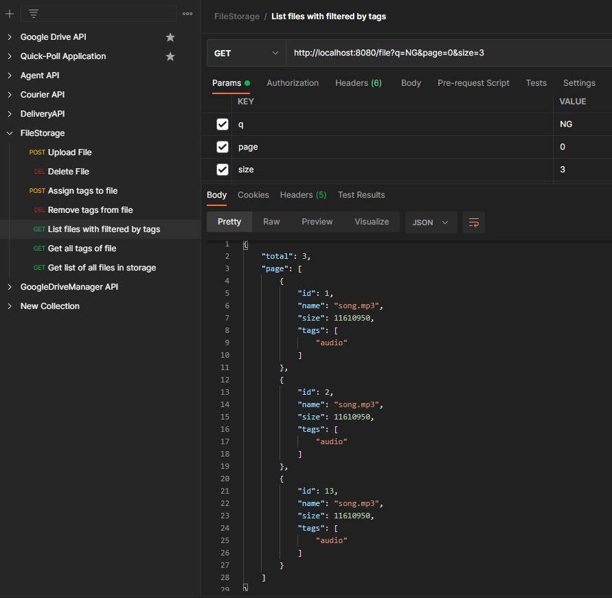

**Bonus**
These items are not obligatory for implementation but if you have time and desire - you could work on them as well once you complete the main assignment. Would be good additional points for your candidature.
* at the upload automatically add tag "audio" / "video" / "document" / "image" etc. based on extension
* in the listing endpoint handle optional parameter q that will apply a search over file name. I.e. if you pass GET /file?q=aaa this will yield files "aaaaaaa.txt", "bbbb aaa ccc.zip", "AaAA.mp3" etc.
* Nice to have some unit / integration tests added.

All realised (sorry but just a few tests - have no free time) + added request for checking tags of desirable file (GET /file/{ID}/tags)

** Additional images of checking work capacities:**

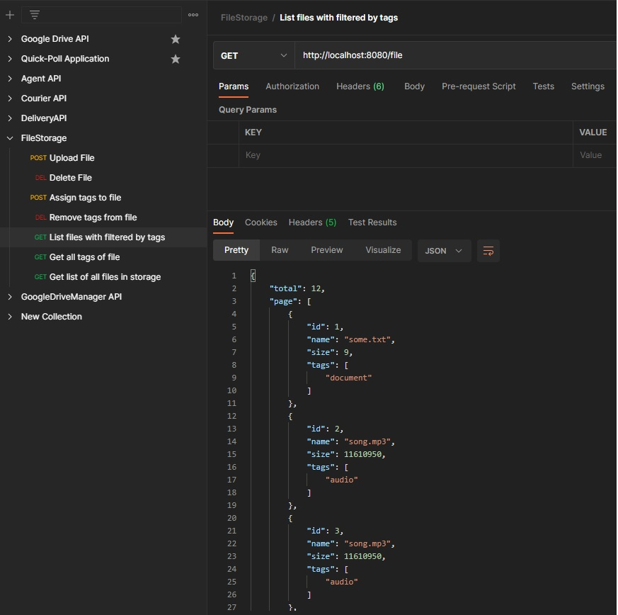

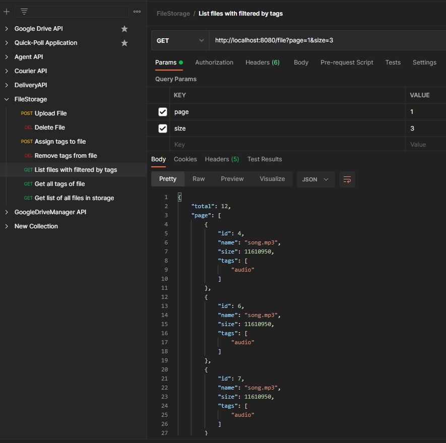

** Images of handling errors**

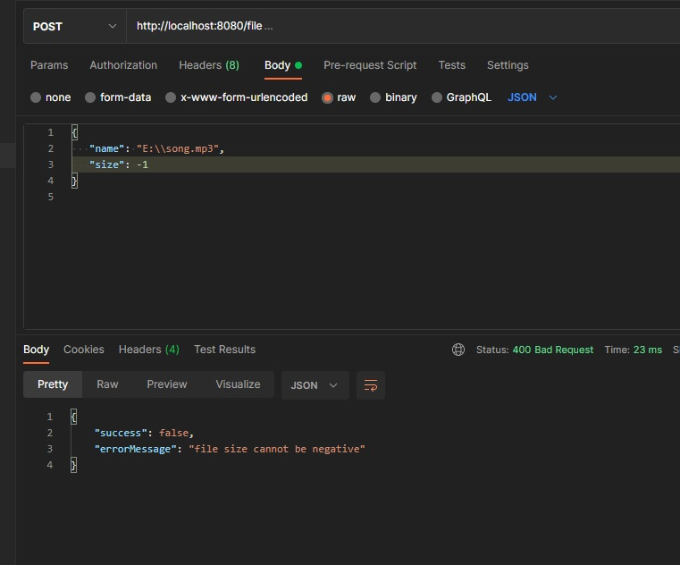

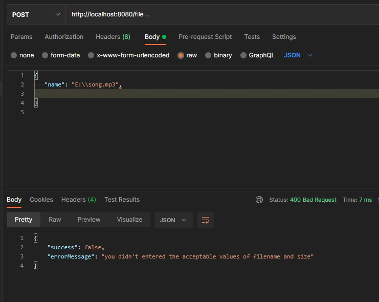

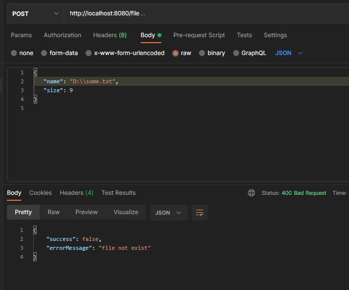

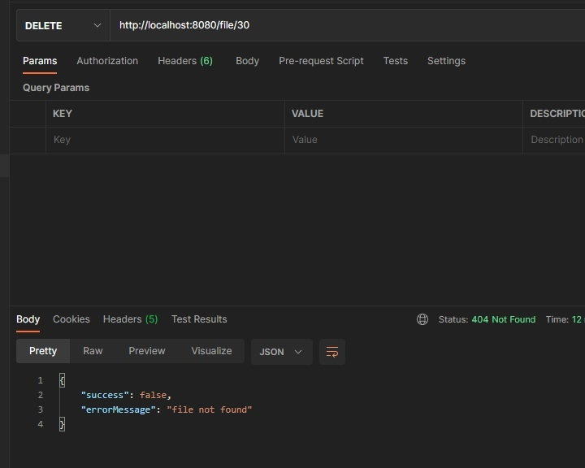

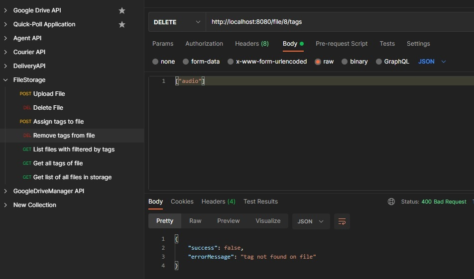

**How to run**
1. Before starting the program, you must have Elasticsearch (link - https://www.elastic.co/downloads/elasticsearch) installed and running (for Windows users - run the elasticsearch.bat from YOUR_DIRECTORY_FOR_ELASTIC\bin\)
2. Run Make.bat / Make.sh (depends on your system) for build project.
3. Run FileStorage.bat / FileStorage.sh for running application.
4. You can import the Postman-collection (in the '\dist\4 Postman' directory) for testing couple of scenarious. 
5. Enjoy! =)

Project was build on Java 11, tested on Java 14, used Postman as front-end

**Technology stack:**
Java 11 + Spring Boot + Elasticsearch (as DB) + Maven

